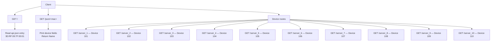

# Flask Network Device App

A Flask application that exposes network device data through HTTP routes. Device information is returned as JSON or, for the MAC lookup route, as a text response.

## Requirements

- Python
- Flask
- `api.json` in the project root

`app.py` loads `api.json` when the application starts. Run the app from the project directory:

```powershell
python -m pip install Flask
python app.py
```

The development server runs at `http://127.0.0.1:5000/`. Debug mode is enabled in `app.py`; disable it before production use.

## Routes

All routes use `GET`, which is Flask’s default.

| URL | What it does |
|---|---|
| `/` | Returns the `api.json` entry for the key `3D:RF:09:7F:00:01`. Flask serializes the returned dictionary as JSON. |
| `/json/<mac>` | Looks up `<mac>` in `api.json`, prints its `Name`, `Protocolos`, `status`, `VLANs`, and `IP` fields to the server console, then returns its `Name` as text. The MAC must exist and contain those fields. |
| `/server_1` | Returns JSON for device 101, Router Principal (`192.168.1.10`, active, `ALLOW_ALL`). Also calls `find_insert(101)`; its return value is not included in the response. |
| `/server_2` | Returns JSON for device 102, Router (`192.168.1.20`, inactive, `ALLOW_ALL`). |
| `/server_3` | Returns JSON for device 103, Switch (`192.168.1.30`, active, `ALLOW_ALL`). |
| `/server_4` | Returns JSON for device 104, Servidor principal (`192.168.1.40`, active, `ALLOW_ALL`). |
| `/server_5` | Returns JSON for device 105, Impresora (`192.168.1.50`, inactive, `ALLOW_ALL`). |
| `/server_6` | Returns JSON for device 106, Firewall Perimetral (`192.168.1.1`, active, `BLOCK_IP`). |
| `/server_7` | Returns JSON for device 107, PC (`192.168.1.60`, active, `ALLOW_ALL`). |
| `/server_8` | Returns JSON for device 108, TV (`192.168.1.70`, inactive, `ALLOW_ALL`). |
| `/server_9` | Returns JSON for device 109, Camara Seguridad IP (`192.168.1.80`, active, `ALLOW_ALL`). |
| `/server_10` | Returns JSON for device 110, Servidor Web (`192.168.1.90`, active, `ALLOW_ALL`). |

The `/json/<mac>` route raises an error if the MAC key or any expected field is missing from `api.json`.

## Route map



## Git branch and push

The GitHub page URL points to the `feature` branch. In the VS Code terminal, check the repository state and branches first:

```powershell
git status
git branch -a
git remote -v
```

If needed, add the repository remote:

```powershell
git remote add origin https://github.com/Gxelds3/Flask.git
```

Switch to the local `feature` branch, or create it if it does not exist:

```powershell
git switch feature
```

If that branch does not exist locally, use:

```powershell
git switch -c feature
```

Then commit the README and push:

```powershell
git add README.md
git commit -m "initial version"
git push -u origin feature
```